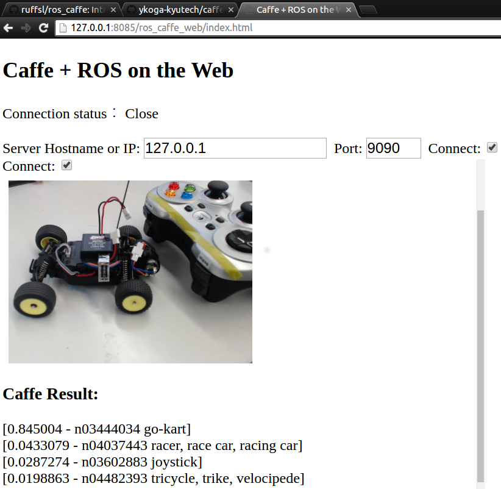

# A simple ROS Caffe package
---

## Description

This package enables users to publish label predictions from a subscribed [ROS](http://www.ros.org/) image topic using a given [Caffe](http://caffe.berkeleyvision.org/) model.

[](https://youtu.be/T8ZnnTpriC0)

>Click the YouTube thumbnail above to watch previous demo video:

## Dependencies

* [Ubuntu](http://www.ubuntu.com/) (or [Docker](https://docs.docker.com/linux/step_one/) Installation)
* Optional
 * [Nvidia Driver](http://www.nvidia.com/object/linux.html) & Hardware
 * [Cuda](https://developer.nvidia.com/cuda-downloads) Installation
  * or [Nvidia Docker Plugin](https://github.com/NVIDIA/nvidia-docker)
 * USB webcam or common `/dev/video0` device

## Installation

For a detailed list of installation steps, you can read through the available Dockerfiles within the project's docker folder. Here we'll assume you want to use a GPU for framerate performance and thus have the latest Nvidia Driver and Hardware installed with a little more than (1/2)GB of free memory to load the network. We'll use Docker to skip the CDUA, CUDNN and ROS installation, and thus we'll need the Nvidia Docker Plugin.

> From here we can build the necessary images like so:

``` terminal
cd ~/
git clone https://github.com/ruffsl/ros_caffe.git
cd ~/ros_caffe/docker/
make build
```

> This will construct the necessary images in order:

* `nvidia/cuda:7.5-cudnn4-devel-ubuntu14.04`: download latest base image with a CUDA/CUDNN develop setup
  * `ros:indigo-caffe`: then build Caffe from source with GPU acceleration enabled
	  * `ros:indigo-ros-caffe`: finally build ros_caffe, this includes any additional build or runtime dependencies
		  * `ros:indigo-ros-caffe-dev`: includes some additional dev tools such as GUIs and common CLIs
			* This is commented out in the `Makefile` to shorten the build

## Running

Now that we have things built we'll need a model to use ros_caffe with.

> First we'll download a model, CaffeNet, to use to generate labeled predictions. This can be done using a small download script to fetch the larger missing caffemodel file.

``` terminal
cd ~/ros_caffe/ros_caffe/
./scripts/download_model_binary.py data/
```

> You can also download other example model files from Caffe's [Model Zoo](https://github.com/BVLC/caffe/wiki/Model-Zoo). Once we have the model, we can run a webcam and ros_caffe_web example using the nvidia docker plugin:

``` terminal
nvidia-docker run \
  -it \
  --publish 8080:8080 \
  --publish 8085:8085 \
  --publish 9090:9090 \
  --volume="/home/${USER}/ros_caffe/ros_caffe/data:/root/catkin_ws/src/ros_caffe/ros_caffe/data:ro" \
  --device /dev/video0:/dev/video0 \
  ros:indigo-ros-caffe roslaunch ros_caffe_web ros_caffe_web.launch
```

> This command proceeds to:

* start up an an interactive container
* publishes the necessary ports to the host for ros_caffe_web
* mounts the data volume from the host with downloaded model
* mounts the host's GPU and camera devices
* and launches the ros_caffe_web example

> You can see the `run` scripts in the docker folder for more examples using GUIs. Also you could change the volume to mount the whole repo path not just the data directory, allowing you to change launch files locally.

``` diff
-  --volume="/home/${USER}/ros_caffe/ros_caffe/data:/root/catkin_ws/src/ros_caffe/ros_caffe/data:ro" \
+  --volume="/home/${USER}/ros_caffe:/root/catkin_ws/src/ros_caffe:ro" \
```

>Now we can point our browser to the local URL to ros_caffe_web for the web interface:  
[http://127.0.0.1:8085/ros_caffe_web/index.html](http://127.0.0.1:8085/ros_caffe_web/index.html)  



## Notes

If you don't have a webcam, but would like to test your framework, you can enable the test image prediction:

``` terminal
roslaunch ros_caffe ros_caffe.launch test_image:=true
...
[ INFO] [1465516063.881511456]: Predicting Test Image
[ INFO] [1465516063.915942302]: Prediction: 0.5681 - "n02128925 jaguar, panther, Panthera onca, Felis onca"
[ INFO] [1465516063.915987305]: Prediction: 0.4253 - "n02128385 leopard, Panthera pardus"
[ INFO] [1465516063.916008385]: Prediction: 0.0062 - "n02128757 snow leopard, ounce, Panthera uncia"
[ INFO] [1465516063.916026233]: Prediction: 0.0001 - "n02129604 tiger, Panthera tigris"
[ INFO] [1465516063.916045619]: Prediction: 0.0000 - "n02130308 cheetah, chetah, Acinonyx jubatus"

```

[](https://en.wikipedia.org/wiki/Leopard#/media/File:Leopard_in_the_Colchester_Zoo.jpg)

> You may also need to adjust the [`usb_cam`](http://wiki.ros.org/usb_cam) node's `pixel_format` or `io_method` values such that they are supported by your camera. Also, if CUDA returns an out of memory error, you can attempt to lower your displays resolution or disable secondary displays to free up space in your graphics' VRAM.

# Nodes
---

## ros_caffe

#### Subscribed Topics

* `~camera_info` (sensor_msgs/CameraInfo)
 * Camera calibration and metadata
* `~image` (sensor_msgs/Image)
 * classifying image

#### Published Topics

* `~predictions` (string)
 * string with prediction results

#### Parameters

* `~model_path` (string)
 * path to caffe model file
* `~weights_path` (string)
 * path to caffe weights file
* `~mean_file` (string)
 * path to caffe mean file
* `~label_file` (string)
 * path to caffe label text file
* `~image_path` (string)
 * path to test image file
* `~test_image` (bool)
 * enable test for test image

## ros_caffe_web

#### Subscribed Topics

* `~image` (sensor_msgs/Image)
 * classifying image

## Author

[ruffsl](https://github.com/ruffsl)

# Credits
---

:coffee: [tzutalin/ros_caffe](https://github.com/tzutalin/ros_caffe): Original fork  
:coffee: [ykoga-kyutech/caffe_web](https://github.com/ykoga-kyutech/caffe_web): Original web interface
